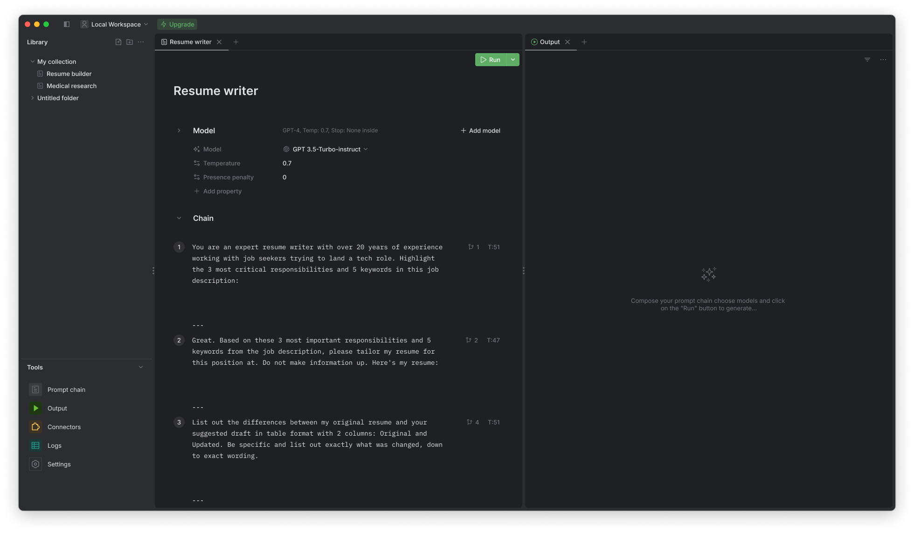

# Prompt Mixer Releases

---

This repo is used for hosting public releases of Prompt Mixer.

With Prompt Mixer, cross-functional teams can easily create, test, and deploy prompts and prompt chains to power advanced conversational experiences.

## Key Features

- 👥 Collaboration - Design, iterate, and manage prompts in one place with integrated version control, commenting, and review workflows.
- ⛓️ Prompt Chaining - Construct sequences of prompts that pass context and information to enable complex dialogues.
- 🔀 Extensibility - Bring in custom models and leverage third-party APIs via connectors.
- 🧪 Testing & Validation - Continuously experiment with and evaluate prompts before putting them into production.

## Getting Started

To learn more about installing and using Prompt Mixer, refer to the [Official Documentation](https://docs.promptmixer.dev/).

The documentation provides comprehensive guides on:

- Installing and configuring Prompt Mixer
- Creating and managing prompts and prompt chains
- Selecting AI models and fine-tuning behavior
- Developing custom connectors
- Testing and deploying prompts
- Integrating prompts into applications
- and more!

## Support

If you encounter any technical issues or need assistance with Prompt Mixer, our support team is here to help. Send us an email at [hello@promptmixer.dev](mailto:hello@promptmixer.dev) with a detailed description of your issue, and we'll get back to you as soon as possible.
